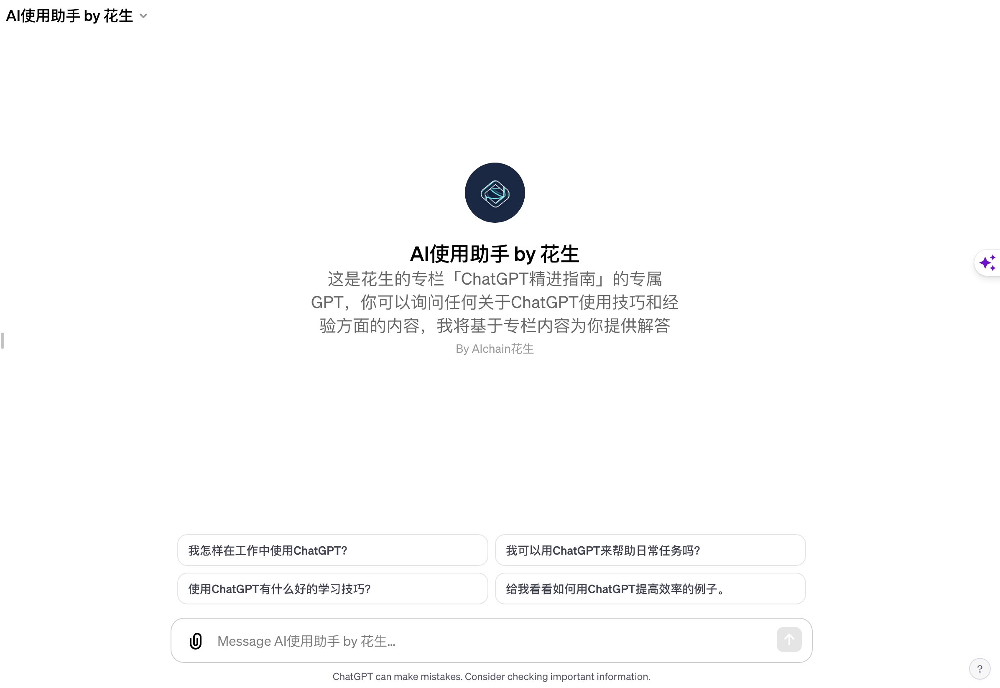

# 我的专栏「ChatGPT精进指南」介绍

专栏订阅链接：https://xiaobot.net/p/AIclass

专栏内容目录：https://xiaobot.net/post/66da3cb8-aca3-4eb1-9b5f-aab687a5012a

ChatGPT的使用是一门实践的艺术。这个专栏致力于用我新鲜、一手、深度的实操经验给你带去启发。

最近半年，我靠着ChatGPT的帮助做的几件事：
1、无代码基础，开发了三款产品在Chrome应用商店上架；
2、出了本书，已在Amazon上线销售；
3、做的视频课程已帮助20万人学习ChatGPT使用技巧。

**注1：专栏定价目前为优惠价199元，还有最后几个名额，订阅满500人后会进一步涨价。**

**注2：提供用AI提效的咨询及培训服务，个人999/小时，企业1999/小时；如果你有特定的问题，也可为你提供相应解决方案，按服务时长收费（专栏用户打8折）。**

## 专栏内容目录
本专栏力求一步步和所有对ChatGPT感兴趣的朋友一起从0到1，所以主题内容也会由浅入深，由基础到深度，由理论到实践，所以你完全可以根据你实际的进展和当前面临的问题选择你感兴趣你需要的文章进行阅读。

在订阅后，你可以添加我的微信：alchain ，注明为专栏读者申请加入读者群。

### 一、基础概念及使用入门
1.1 什么是AI

1.2 什么是ChatGPT？

1.3 怎么注册使用ChatGPT？

1.4 什么是OpenAI的API key？有什么用？

1.5 ChatGPT是怎么被训练出来的？

1.6 ChatGPT和人类思维的差异

### 二、Prompt基础
2.1 学会提问：自我需求分析

2.2 问题表述：好的prompt应该是什么样的

2.3 一个Prompts，让ChatGPT实现问答自闭环

2.4 Prompt的精髓：阶梯式前行（以引入产品经理为例）

2.5 提升与 ChatGPT 对话能力的 7 个技巧

2.6 LLM不想成功，但你可以要求成功

2.7 阶段性总结：28个ChatGPT使用技巧

2.8 ChatGPT+DALLE3的系统级Prompt学习

2.9 诺奖得主赫伯特·西蒙带来的Prompt启发

2.10 Take a step back「后退一步」的提示技巧

2.11 工作流Prompt策略——让ChatGPT翻译质量超越人类译者

### 三、ChatGPT分场景应用实例
3.1 用什么提示词（prompt）能让ChatGPT写出优秀的论文

3.2 AIGC时代下的产品运营新技巧：借鉴亚马逊的PRFAQ方法

3.3 产品经理日常工作中可以用到的30条prompt

3.4 用户增长运营日常工作中可以用到的25条prompt

3.5 ChatGPT翻译示例：How to do great work

3.6 ChatGPT在教学领域的应用

### 四、更多AI产品体验&分享
4.1 ChatGPT+MidJourney的魔法组合

4.2 Auto-GPT简介以及本地部署使用说明

4.3 ChatGPT延伸工具推荐

### 五、ChatGPT深度使用分享
5.1 ChatGPT Plugins(插件)的最新一手使用体验

5.2 Chat with Everything（一个新鲜的脑洞）

5.3 ChatGPT代码解释器插件一手使用经验

5.4 AI的使用是一门实践的艺术：介绍下我0代码基础做开发的经验

5.5 ChatGPT新推出的Custom instructions使用技巧

5.6 GPT-4V(ision)视觉能力的86种使用场景

### 六、其他文章
世界读书日特辑：让ChatGPT助你高效阅读

推荐：吴恩达的Prompt Engineering课程（含翻译稿）

OpenAI发布iOS版本ChatGPT app

AIGC示例-科普文：动物的随机漫步

AIGC示例-科技新闻：Auto-GPT，自主AI代理的崛起、潜力与挑战

媒介即讯息：ChatGPT如何改变人类沟通和思考方式

一份并不全的AI学习资料

介绍下我开发的网站bookAI.top

第一份「生成式人工智能证书」，附参考答案

带上了眼睛、耳朵和嘴巴的多模态ChatGPT登场

## 我是谁

我是花生，🚀此前十年，我在阿里与美团担任用户增长专家，现致力于AI教育🤖和独立软件开发🛠️。我创造了三款Chrome插件来提升你的数字体验：1️⃣ 阅读效率飞跃 -「AI阅读助手」；2️⃣ 购物效率革新 -「ChatGPT for Amazon」；3️⃣ 写作效率提升 -「flomoAI」。

## 我的几款产品和相关信息

### 1、Chrome插件「AI阅读助手｜豆瓣读书｜微信读书」

本插件基于OpenAI的API开发，功能是当你打开任何豆瓣读书｜微信读书的书籍页面时，右边会弹出一个对话框，其中包含这本书的基本总结，然后你可以与这本书进行对话，例如询问有关书籍的任何信息，或让它出题考察你对书的理解，帮助你复习。

### 2、Chrome插件「flomoAI｜Copilot for flomo」

这是一个极其简单的基于OpenAI的API开发的插件，在安装后不会给你的flomo界面额外增添任何UI界面。简单描述效果的话，你可以认为给你的flomo加上了免费的类NotionAI的（10%）能力。插件的使用你只需记住一个触发词和两个指引词：

触发词：在flomo顶部编辑框的任起一行输入「gpt:」,后面补充你希望gpt帮你做的指令，然后回车就可以了，通常在1-2秒后gpt的回复会直接补充到你指令的下方。

指引词：常规情况下，插件只会讲你在「gpt:」后那一行输入的指令发送给OpenAI，这适用于你一般问问题的场景，但是如果你是希望对编辑框内的已有文本进行加工，可以在指令词里面直接描述「上面」「下面」这样的指引词，这种情况下，插件会将你该行指令上方或下方的文本一同作为指令发送给OpenAI。比如，你可以写「gpt:帮我检查上面的文本是否有错别字或语病」。

### 3、我出的一本书《Mastering ChatGPT:Unlock the Full Potential of AI-Powered Conversations》

这是我最近在亚马逊上出的书，但是因为是for海外市场的需要，为纯英文版本，我不建议你购买，本专栏会包含这本书涉及的所有内容，以及更多更新的信息。

同时，我制作了「AI使用助手 by 花生」GPTs，这是我的「ChatGPT精进指南」专栏的专属GPT，你可以询问任何关于ChatGPT使用技巧和经验方面的内容，我将基于专栏内容为你提供解答。如果你已经是ChatGPT Plus会员了，你可以通过这个链接访问：https://chat.openai.com/g/g-DHQ7aefMk-aishi-yong-zhu-shou-by-hua-sheng

