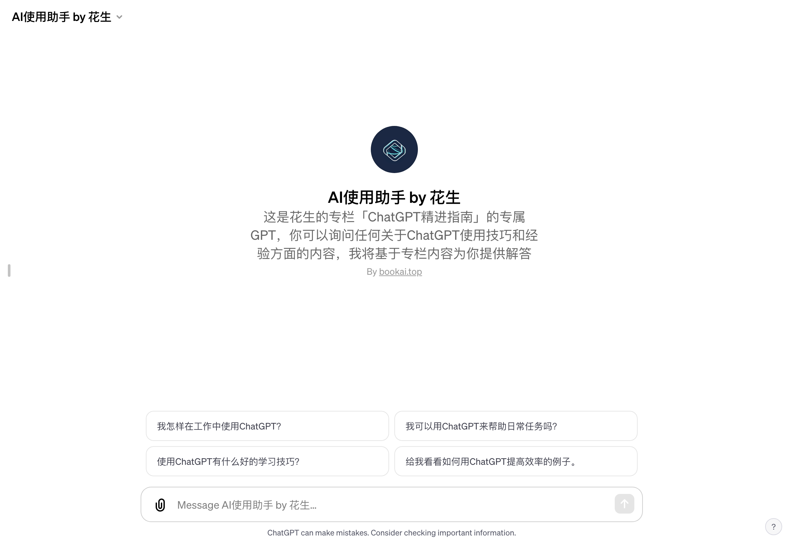

# AI使用助手 by 花生

「AI使用助手 by 花生」访问链接：https://chat.openai.com/g/g-DHQ7aefMk-aishi-yong-zhu-shou-by-hua-sheng

「AI使用助手 by 花生」，是一款专门为提高工作、学习和日常生活效率而设计的人工智能导师。这款工具基于OpenAI的先进技术打造，具有强大的信息处理和解答能力，能够协助用户高效利用ChatGPT。

## 什么是 AI使用助手？
AI使用助手不仅仅是一个普通的聊天机器人。它被专门定制，具备从特定的文档中快速检索信息的能力，并且能够以简洁、逻辑性强的方式回答问题。这款工具的开发初衷是帮助用户更有效地利用ChatGPT，无论是在工作、学习还是日常生活中。

## 如何帮助用户？
- 工作效率提升：AI使用助手能够提供职场相关的智能建议和信息检索服务，帮助用户处理电子邮件、编写报告或进行数据分析。
- 学习支持：对于学习者，这款工具可以提供学习资料的概要、关键概念的解释和学习方法的建议。
- 日常生活协助：AI使用助手还能够帮助用户规划日常生活，比如提供健康建议、时间管理技巧等。

## 它是如何工作的？
用户在使用时只需向AI使用助手提出问题或请求帮助，它会首先尝试从内置的知识源中找到答案。如果内置知识源中没有相关信息，它还能通过互联网搜索来提供支持。这种工作方式使得AI使用助手能够快速、准确地回答用户的问题。

## 为什么选择 AI使用助手？
选择AI使用助手的最大优势在于其高效和专业。这个工具不仅集成了最新的人工智能技术，还特别注重安全意识，确保用户信息的安全。另外，它还能根据用户的具体需求提供个性化的解答和建议，大大提升工作和学习效率。

## 与传统搜索工具的区别
与传统的搜索引擎或问答工具相比，AI使用助手更加智能和灵活。它不仅能提供标准答案，还能根据用户的具体情况给出建议和指导，这对于那些需要特定信息或面临复杂问题的用户来说是一个巨大的优势。

## 适用人群
AI使用助手适合广泛的用户群体，包括但不限于企业员工、学生、研究人员和日常生活中希望提高效率的人。无论是需要职场建议、学术支持还是日常生活的智能化管理，AI使用助手都能提供有效的帮助。