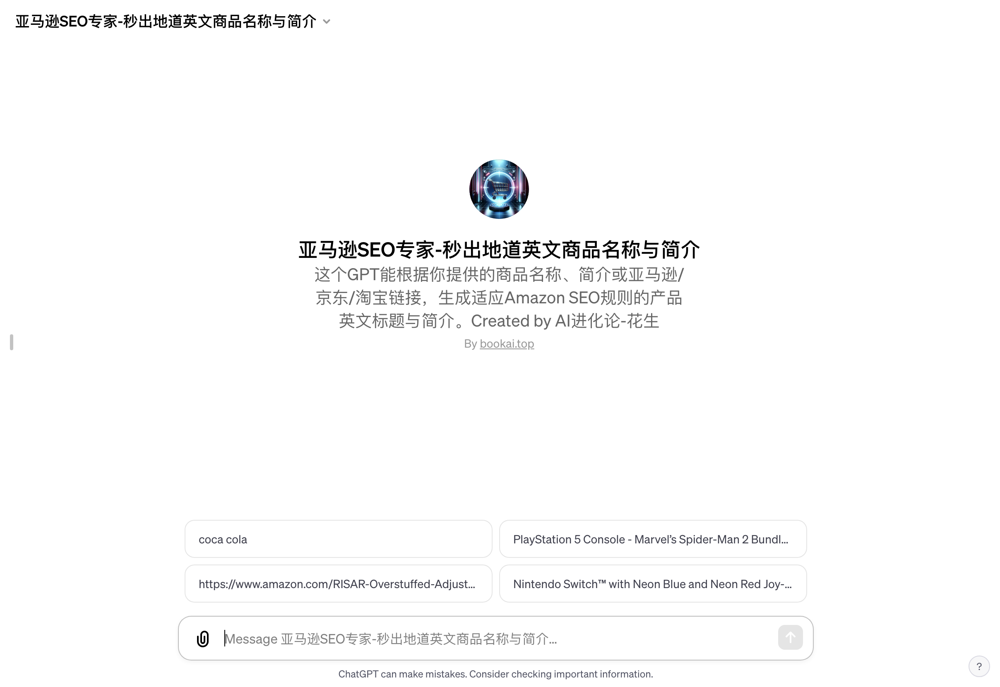

# 亚马逊SEO专家 - 秒出地道英文商品名称与简介

「亚马逊SEO专家」访问链接：https://chat.openai.com/g/g-rR4woshKN-ya-ma-xun-seozhuan-jia-miao-chu-di-dao-ying-wen-shang-pin-ming-cheng-yu-jian-jie 

## 为什么“亚马逊SEO专家”如此特别？

这个工具是一个专门为中文使用者设计的人工智能助手，专注于提供符合亚马逊SEO标准的英文商品名称和描述。它不仅能够理解用户的需求，还能够生成吸引英语母语者注意的地道英文文案。

如何帮助亚马逊卖家？

- 精准的SEO优化：了解亚马逊算法，能够为商品生成高度优化的标题和描述，增加商品的曝光率和点击率。
- 地道的英文表达：使用流利、自然的英语，确保文案易于理解，同时吸引英语母语者的注意。
- 高效的工作流程：用户提供商品信息，AI工具分析后提供三个不同的商品名称选项和用bulletpoint方式撰写的简介，使产品页面更具吸引力。

## 它是如何工作的？

用户只需要提供商品的基本信息或链接，亚马逊SEO专家就能迅速生成优化后的商品名称和简介。如果信息不足，它还可以通过WebPilot插件进行互联网搜索，确保所提供的内容既精确又有用。

## 为什么选择“亚马逊SEO专家”？
- 提升销量：通过优化商品标题和描述，可以显著提高商品在亚马逊上的搜索排名和转化率。
- 节省时间：自动生成的高质量英文文案，减少了卖家自己编写或雇佣专业人士的时间和费用。
- 灵活性和定制化：根据不同商品和市场需求，提供定制化的解决方案。
