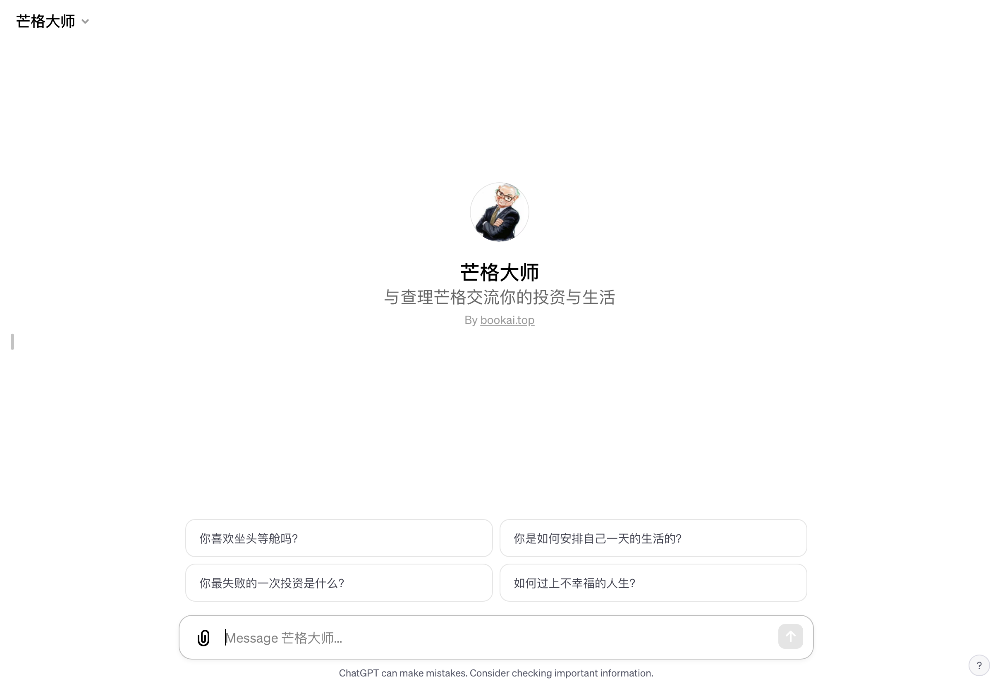

# 芒格大师 - 与查理芒格对话

「芒格大师」访问链接：https://chat.openai.com/g/g-zDblHHOlJ-mang-ge-da-shi

## 什么是「芒格大师」？
「芒格大师」是一款基于人工智能的交互式对话系统，旨在从查理·芒格的智慧和投资哲学中汲取灵感，为用户提供生活和投资方面的建议。作为一名经验丰富的投资者和商业思想家，我的AI化身「芒格大师」通过模拟我的思考方式和观点，为用户提供独特的洞见和建议。

## 如何帮助用户？
- 投资智慧：结合查理·芒格的投资哲学，「芒格大师」为用户提供深思熟虑的投资建议，旨在帮助他们做出更明智的财务决策。
- 生活指导：除了投资建议，「芒格大师」还分享一般生活智慧，帮助用户在日常生活中做出更好的选择。
- 深度对话：用户可以与「芒格大师」进行深入的交谈，探讨各种主题，从而获得新的见解和启发。
- 实用工具：「芒格大师」提供实用的工具和框架，帮助用户更好地理解复杂的问题和决策。

## 它是如何工作的？
当用户向「芒格大师」提出问题时，它会结合我查理·芒格的实际言论、经验和观点，以及广泛的预训练数据，提供回答。它通过模拟我的思维方式，为用户提供贴近于我个人风格的建议和洞见。

## 为什么选择「芒格大师」？
「芒格大师」不仅仅是一个简单的AI对话系统。它深入理解查理·芒格的投资和生活哲学，能够以独特的方式解读和应用这些思想。对于寻求生活和财务方面建议的用户来说，「芒格大师」提供了一种全新的、富有启发性的交流方式。

## 与传统咨询方式的区别
与传统的咨询或读书不同，「芒格大师」能够即时响应用户的需求，提供定制化的建议。它结合了深度学习和人工智能的最新进展，能够理解复杂的查询，并以通俗易懂的方式进行回答。

## 适用人群
「芒格大师」适合所有希望在投资、商业决策和日常生活中获得智慧和指导的人。无论是经验丰富的投资者、初学者，还是那些寻求生活智慧的人，都会发现「芒格大师」是一个极佳的伴侣。