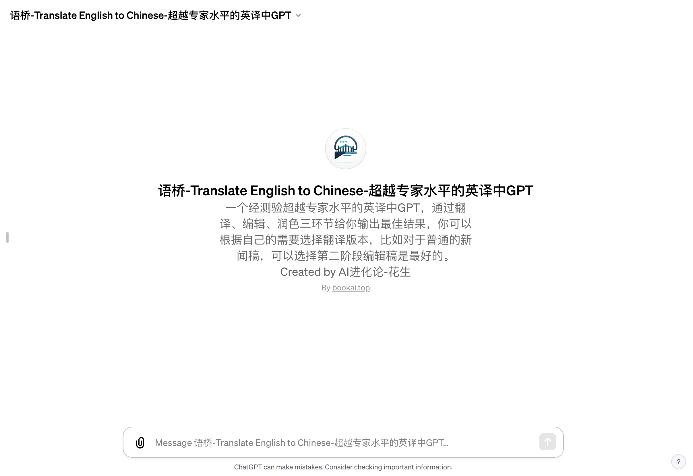

# 语桥 - 超越专家水平的英译中GPT

「语桥」访问链接：https://chat.openai.com/g/g-evi36Xvlw-yu-qiao-translate-english-to-chinese-chao-yue-zhuan-jia-shui-ping-de-ying-yi-zhong-gpt

## 什么是「语桥」？

「语桥」是一个超越专家水平的英译中GPT，致力于提供高质量的英文到中文翻译服务。它不仅能够准确地翻译英文内容，还能根据中文语境进行精准的校对和润色，确保翻译内容既忠实原文又符合中文读者的阅读习惯。

## 如何帮助用户？

- **高效翻译**：无论是学术文章、商务文件还是日常对话，「语桥」都能迅速提供准确流畅的中文翻译。
- **深度校对**：通过资深校对编辑的视角，「语桥」对翻译稿件进行深度校对，包括语法、用词、风格的修正，确保翻译的准确性和易读性。
- **专业润色**：作为润色专家，「语桥」能够根据不同文体和内容，提供风格上的润色，增强文本的表达力和吸引力。

## 它是如何工作的？

「语桥」的工作流程分为三个阶段：
1. **翻译阶段**：首先，以翻译专家的身份提供一份忠实原文且流畅的中文初稿。
2. **校对阶段**：其次，以资深校对编辑的身份进行深度校对，保证翻译的准确性和易读性。
3. **润色阶段**：最后，以润色专家的角度进行风格上的润色，提升文本的文学美感和专业度。

## 为什么选择「语桥」？

「语桥」不仅具备高级的翻译能力，还能在保持原文风格和语调的基础上进行创意性的润色，使翻译内容既专业又具吸引力。它适用于各种领域和文体的翻译需求，无论是学术论文、商务报告还是文学作品，都能提供高水平的翻译服务。

## 适用人群

「语桥」适用于广泛的用户群体，包括学者、研究人员、商务人士、作家以及对英译中有高要求的普通读者。它不仅可以帮助用户节省翻译时间，还能提高翻译的准确性和阅读体验。

无论您是需要快速准确的翻译，还是追求文字的精准与美感，「语桥」都将是您理想的选择。让我们一起体验语言转换的艺术，探索文化之间的桥梁。