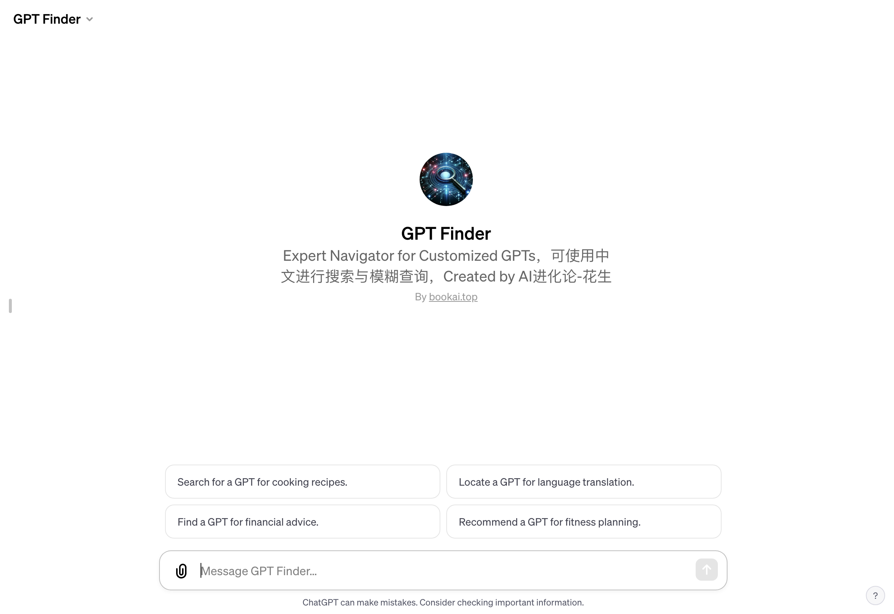

# GPT Finder - 你的专业GPT搜索助手

「GPT Finder」访问链接：https://chat.openai.com/g/g-tudO6FuDg-gpt-finder

## 什么是 GPT Finder？

GPT Finder 是一个专门为用户寻找和推荐定制化GPTs的工具。它结合了最新的人工智能技术，专门针对OpenAI推出的允许用户进行专属定制的GPTs类型进行搜索和分析。GPT Finder不仅能够帮助用户快速找到他们需要的特定GPT，还能提供详细的介绍和直接访问链接。

## GPT Finder的特点

- **精确搜索**：通过对用户需求的准确理解，GPT Finder能够在众多定制化GPTs中迅速找到最符合用户需求的选项。
- **丰富的数据库**：覆盖了各个行业和领域的GPTs，无论用户的需求是什么，GPT Finder总能找到合适的答案。
- **直接访问链接**：为用户提供每个GPT的直接访问链接，方便用户快速体验和使用。
- **详细介绍**：每个GPT都配有详细的介绍，帮助用户了解其功能和适用场景。

## 如何帮助用户？

- **节省时间**：用户无需自己在网上寻找和比较，GPT Finder可以迅速提供最佳选择。
- **专业推荐**：根据用户的具体需求，GPT Finder可以提供专业的GPT推荐。
- **多样化选择**：涵盖多个行业和专业领域，为用户提供多样化的选择。

## 它是如何工作的？

当用户提出特定的GPT需求时，GPT Finder会首先通过其内置的搜索引擎在各大平台进行搜索，包括google、bing、x.com、gptshunter.com、gptstore.io等。搜索结果将仅显示带有'https://chat.openai.com/g/*'格式的GPT链接，保证了结果的精准性和可访问性。

## 为什么选择 GPT Finder？

选择GPT Finder的理由有很多：
- **高效率**：它能在短时间内为用户找到最合适的GPT。
- **高精准度**：GPT Finder的搜索结果精确，确保用户能够得到他们真正需要的GPT。
- **用户友好**：简单易用的界面，让用户的搜索体验更加轻松愉快。
- **不断更新**：随着市场上新的GPTs的推出，GPT Finder会不断更新其数据库，提供最新的信息。

## 使用场景

GPT Finder适用于各种需要寻找特定GPT的场景，无论是企业用户寻找行业特定的解决方案，还是个人用户寻找兴趣相关的GPT，GPT Finder都能提供有效的帮助。

## 结语

作为一款专业的GPT搜索工具，GPT Finder不仅能帮助用户节省宝贵的时间，还能确保用户获得最准确、最适合的GPT推荐。无论您是对GPT技术感兴趣的个人，

