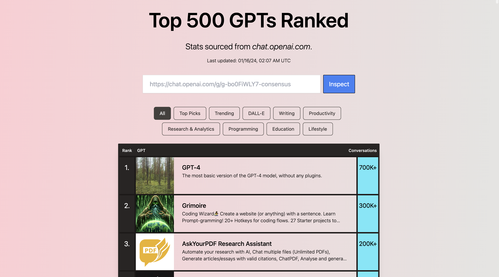
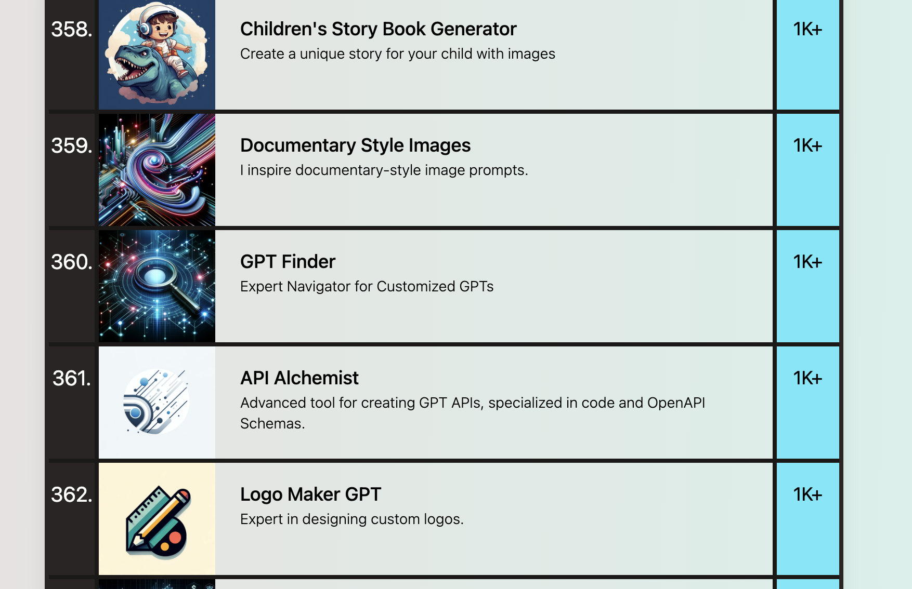
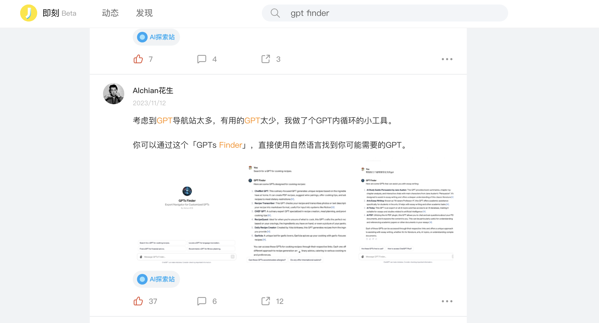
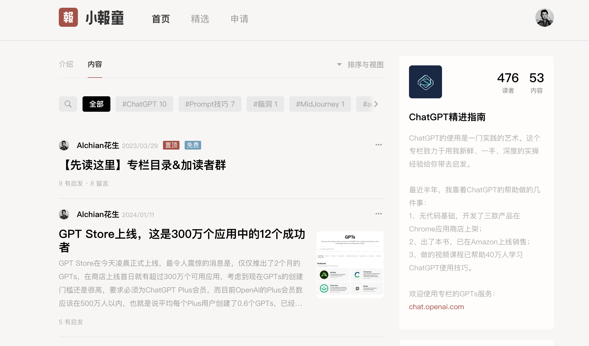

# 我做的GPT，在全球300万个GPT中排Top360，这是我的一些经验分享

有大神按使用量数据做了个全球Top500的GPT排名，我最早做的一个GPT「GPT Finder」在其中排名360位。考虑到现在GPT Store有超过300万个GPTs，我做的这个GPT可以说是万中选一了。

但，实际上，我做它只花了大概半小时的时间。在这篇文章里我会详细向你介绍我做这个GPT的来龙去脉，告诉你做出一个成功的被广泛使用的GPT的关键所在。同时，因为我账单地址是美国，OpenAI在博客中提到在2024年Q1将向美国的GPTs Builder按使用量支付费用，如果你想知道TOP500的GPTs能分到多少钱的话，欢迎关注我。

### 经验一：制作你自己真正需要的东西
在互联网产品领域，关于产品经理究竟该不该是自己产品的典型用户，常常有两个冲突性的理念。
有的人说应该是，因为只有你真正在用自己的产品，你才能真正知道这款产品的用户需要的是什么；也有人说不该是，因为你自己始终只能代表一小撮的用户，过于在意自己的看法可能会导致忽略了实际用户的需要。
这两种观点都没错，但是如果你是一个没做过产品经理的，或者你刚入门开始尝试独立开发，那你最好的选择还是成为自己产品的用户。
相比你去YY别人需要什么东西，这往往需要强大的同理心和用户理解的能力。你理解自己总是容易得多，而且你会更知道这个需求的特点和边界，只要你做出来的东西是你自己真正需要的，并且觉得好用的。由于你通常没那么特别，你的这份需要往往还有大量的知音。
我当时做这个GPT的想法是，官方GPT Store还没出来，而导航站冒出来了这么多，我根本不想也没时间去一个个看，而且当时很多GPT导航站甚至没有搜索功能，所以做一个能去查找其他GPT的GPT是再合理不过的选择了。

### 经验二：快速上线，做MVP再迭代
MVP 是 "最小可行产品"（Minimum Viable Product）的缩写。GPT制作这么容易，而且我预期很多需求不会只有我一个人想到的，所以你应该想方设法更快把产品做出来。
比方说我的这个GPT Finder，实际上查找GPT的模式有很多种，比如我可以写一个爬虫，把所有GPTs爬下来做成一个数据库，并且通过Actions的API接入我的GPT，但是又要写爬虫，又要做数据库，还要写API，我很难快速搞定。
还有个方式是，我可以把GPTs数据整理成表，作为知识库传到GPT中，但是这个问题是当时GPT新增得太快了，我总要更新表格也会是相当大的工作量。
所以，我采用了一个相当偷懒的做法，让我的GPT通过一定规则去检索其他GPTs，具体的Instructions的写法我在之前GPTs入门的视频中就有提及，你可以通过这个链接查看：https://www.bilibili.com/video/BV1jC4y1E73E/ 

### 经验三：Build in Public
就是在社交媒体上公开构建自己的产品，比如我做完这个GPTs之后，在即刻发了，在朋友圈发了，也在youtube和B站做了相关的视频介绍，这种公开构建的过程可以为我的产品进行宣传，获得初期种子用户，也能了解用户需求，为产品获得必要的反馈去进行进一步的迭代。
对了，也是因为这个公开构建的过程，当时这个GPT还得到了YouTube14万粉丝博主jojo的推荐，想必也为我的GPT获取到了不少流量。
如果你目前缺少粉丝群体让你可以实现公开构建的过程的话，也欢迎在视频下方自荐你创作的GPTs，预计能获得一定关注。而且如果我觉得确实比较好的话，后面也会做专门的视频介绍大家制作的GPTs。
事实上，除了这个GPT Finder以外，我的AI使用助手也获得了超过900人的使用，与查理芒格进行对话的「芒格大师」，做专业英译中翻译的「语桥」，也分别获得了400多和300多的使用量。
也许你看过很多博主分析GPT Store，做GPTs制作的教程，但他们自己制作的GPT往往拿不到什么结果，毕竟，开发者和内容创作者属于两类特质要求非常不同的群体。而我大言不惭的说，我自己是个少有的真正有自己实操、实践，且真诚向你分享的博主。
如果你对学习真正实操的AI使用经验感兴趣的话，欢迎通过：https://xiaobot.net/p/AIclass 订阅我的「ChatGPT精进指南」专栏，加入我的AI学习社群。我社群中的小伙伴制作的GPTs将更有机会获得我的推荐。

### 附：下面是我制作的自己比较满意的几款GPTs：
1. 帮你查找你需要的GPTs「GPTs Finder」：https://chat.openai.com/g/g-tudO6FuDg-gpt-finder
2. 与查理芒格对话的「芒格大师」：https://chat.openai.com/g/g-zDblHHOlJ-mang-ge-da-shi
3. 专业英译中助手「语桥」：https://chat.openai.com/g/g-evi36Xvlw-yu-qiao-translate-english-to-chinese-chao-yue-zhuan-jia-shui-ping-de-ying-yi-zhong-gpt
4. 生成SD提示词「Stable Diffusion提示词生成器」：https://chat.openai.com/g/g-vYa9mkSrz-stable-diffusionti-shi-ci-sheng-cheng-qi
5. 做出海电商必用的「亚马逊SEO专家」：https://chat.openai.com/g/g-rR4woshKN-ya-ma-xun-seozhuan-jia-miao-chu-di-dao-ying-wen-shang-pin-ming-cheng-yu-jian-jie 
6. 会帮你设计logo并阐述设计理念的「极简Logo设计」：https://chat.openai.com/g/g-EdkkIkNTv-ji-jian-logoshe-ji-hui-xiang-ni-jie-shi-she-ji-li-nian-de-logoshe-ji-zhuan-jia
7.  让你快速了解书籍获得总结和阅读帮助的「AI阅读助手」：https://chat.openai.com/g/g-xjZjqgHet-aiyue-du-zhu-shou-read-better/

