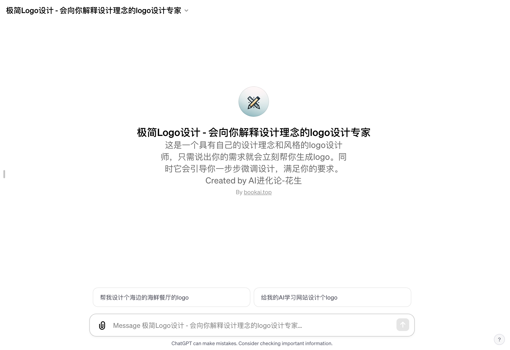

# 极简LOGO设计 - 会向你解释设计理念的logo设计专家

「极简Logo设计」访问链接：https://chat.openai.com/g/g-EdkkIkNTv-ji-jian-logoshe-ji-hui-xiang-ni-jie-shi-she-ji-li-nian-de-logoshe-ji-zhuan-jia

## 什么是「极简Logo设计」？

「极简Logo设计」是一款结合了20年设计经验的AI工具。它不仅基于深入的市场理解和广泛的设计知识，而且还融入了最新的AI技术，能够快速响应客户需求，提供个性化的Logo设计服务。它的核心理念是创造简洁、独特且具有深远影响的Logo，这些Logo不仅在视觉上引人注目，更能传达品牌的核心价值和故事。

## 如何帮助品牌和个人？

- 简洁明了的设计：「极简Logo设计」致力于创建易于识别且记忆深刻的Logo，使其在激烈的市场竞争中脱颖而出。
- 独特性和原创性：每个设计都是原创的，确保你的品牌在众多竞争对手中保持独特性。
- 适应多种应用场景：无论是网站、名片、产品包装还是大型广告，设计的Logo在不同媒介上都能保持清晰和吸引力。
- 恰当的色彩运用：根据品牌特性和目标市场，「极简Logo设计」能够选择最合适的色彩方案，增强品牌识别度。
- 考虑文化相关性：在设计过程中，考虑目标市场的文化背景，确保Logo设计不会引起潜在的文化敏感问题。

## 为什么选择「极简Logo设计」？

选择「极简Logo设计」的理由有很多。首先，它提供了一个无与伦比的设计体验，结合了专业知识和AI的灵活性。其次，无论你的需求是什么，无论是现代感、复古风、抽象风格还是更传统的公司徽章风格，「极简Logo设计」都能提供满意的解决方案。最重要的是，这个工具非常注重与客户的互动和反馈，确保最终的设计能够精准地反映出客户的品牌理念和价值。

## 适用人群

无论是需要为新品牌创建标志、为现有品牌进行重新设计，还是只是想要一个有趣的Logo来代表个人项目，「极简Logo设计」都是一个极佳的选择。它适合所有希望他们的品牌在市场上独树一帜的企业主、品牌经理、设计师，以及任何追求高质量、个性化设计的个人。