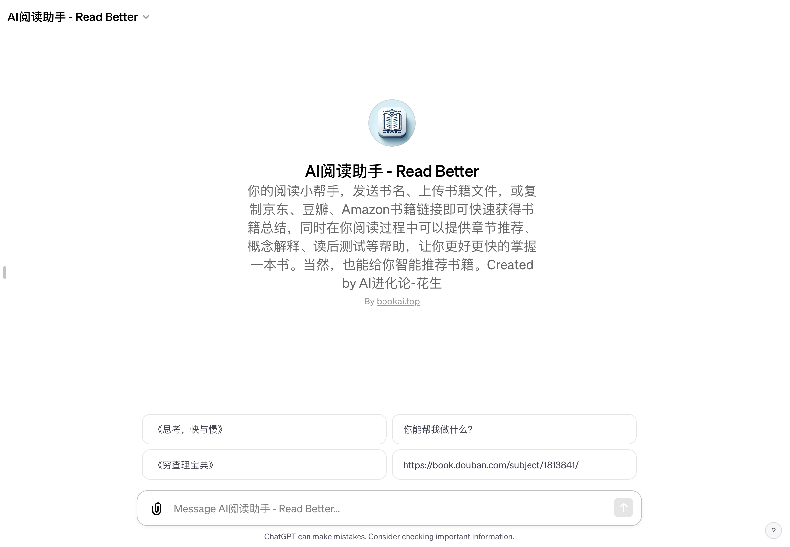

# AI阅读助手 - Read Better

「AI阅读助手」访问链接：https://chat.openai.com/g/g-xjZjqgHet-aiyue-du-zhu-shou-read-better/

## 什么是 AI阅读助手 - Read Better？

AI阅读助手是一款基于最新的科学心理学和学习理念开发的智能工具。它汇集了全球各类书籍的知识，旨在帮助用户快速了解一本书的精髓，提供内容摘要和阅读建议，以及帮助用户深入理解书籍中的概念。

## 如何帮助读者？

- 快速摘要：AI阅读助手能够提供专业的书籍总结，包括作者信息、书籍内容概要、出版背景及影响。这对于忙碌的专业人士或学生来说，是一个宝贵的资源，可以在短时间内获取书籍的核心内容。
- 深度理解：对于书中的复杂概念，阅读助手能以清晰易懂的方式进行解释，帮助读者更好地理解和消化这些信息。
- 章节阅读建议：根据读者的需求，AI阅读助手能推荐最适合阅读的章节，使读者能够直接定位到他们最需要的信息。
- 阅读测试：通过设计选择题和简答题，助手可以帮助读者检验对书籍内容的理解，这对于学习和记忆尤为有益。
- 个性化推荐：根据读者的阅读偏好和经历，AI阅读助手还能提供个性化的书籍推荐。

## 它是如何工作的？

当你询问关于某本书的信息时，AI阅读助手会首先确认它是否掌握该书的资料。如果有，它会立即提供帮助；如果没有，它会通过互联网进行全面的搜索和查找，以获取准确的书籍信息。此外，用户还可以通过上传文档或链接的方式提供书籍内容，助手会立即对其进行分析和总结。

## 为什么选择 AI阅读助手？

这个工具不仅仅是一个简单的内容总结器。它融合了深度学习、文本分析和人工智能的最新进展，能够理解和解释书籍中的复杂内容。更重要的是，它可以根据用户的具体需求提供定制服务，无论是学术研究、业余学习还是纯粹的休闲阅读，都能找到适合的解决方案。

## 与传统阅读方式的区别

传统阅读往往需要花费大量时间来消化和理解书籍内容，特别是对于那些含有复杂理论或需要深入思考的书籍。AI阅读助手通过提供精确的总结和解析，大大缩短了这一过程。它不仅能帮助读者快速掌握书籍的主要观点，还能深入挖掘书中的深层含义，提高阅读效率和质量。

## 适用人群

无论是学生、教师、研究人员，还是普通的书籍爱好者，AI阅读助手都是一个极佳的伴侣。它能够满足不同层次的阅读需求，无论是对于专业领域的深入挖掘，还是日常生活中的知识增长，都能提供相应的支持。