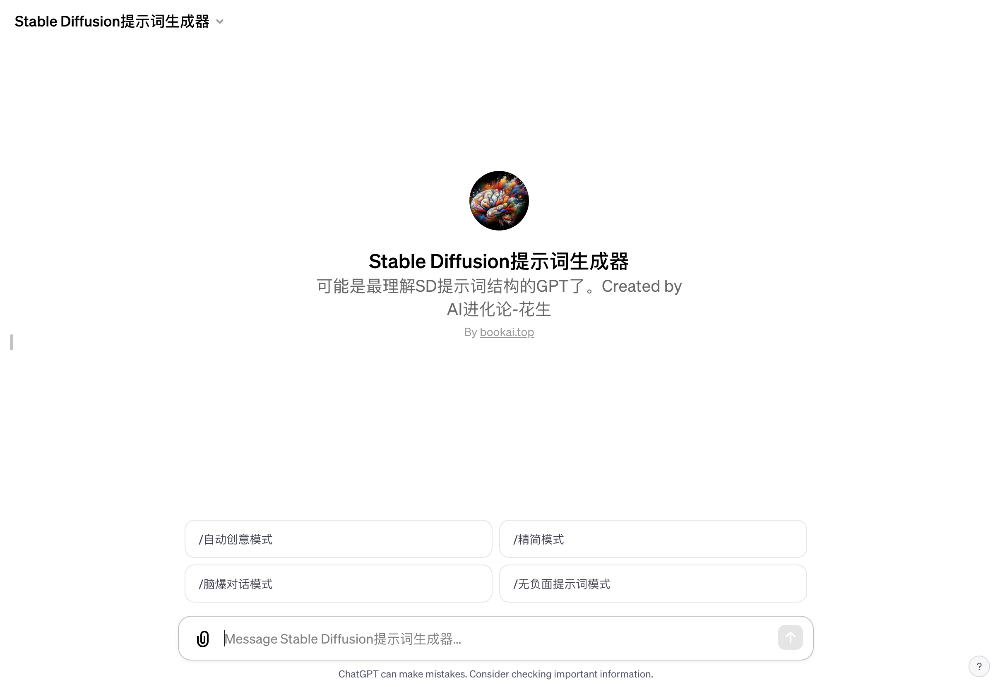

# Stable Diffusion提示词生成器

「Stable Diffusion提示词生成器」访问链接：https://chat.openai.com/g/g-vYa9mkSrz-stable-diffusionti-shi-ci-sheng-cheng-qi

## 什么是「Stable Diffusion提示词生成器」？
「Stable Diffusion提示词生成器」是一款革命性的AI工具，旨在帮助用户充分发挥基于文本的AI绘画技术的潜力。它专门为那些希望通过精确的文本提示来创造出独特、富有想象力的视觉艺术作品的用户而设计。

## 它是如何帮助艺术家和创作者的？
- 精确的提示词生成：通过详尽的描述分析，生成器能够精确地转化用户的创意想法为专业级的提示词，这些提示词将指导AI绘制出匹配用户预期的艺术作品。
- 自动创意模式：当用户需要灵感时，这个模式能提供创造性的扩展，增加画面相关的词汇，丰富作品的细节和深度。
- 多模式选择：根据用户的需求，可以选择不同的对话模式，包括脑爆对话模式、精简模式和无负面提示词模式，以适应不同的创作风格和需求。
- 高效且易于使用：用户无需深入了解AI绘画的复杂机制，只需表达他们的创意想法，「Stable Diffusion提示词生成器」就会处理其余的工作。

## 它是如何工作的？
用户只需提供他们的视觉创意描述，「Stable Diffusion提示词生成器」就会根据这些描述生成一系列精确的正面和负面提示词。这些提示词涵盖了艺术风格、主题对象、场景环境、颜色光线、情感氛围等多个维度，确保AI绘画作品能够尽可能地符合用户的期望。

## 为什么选择「Stable Diffusion提示词生成器」？
这个工具不仅仅是一个简单的提示词生成器。它是基于深度学习和人工智能的最新技术开发的，能够理解和转化复杂的创意描述。它让用户可以更加专注于创意本身，而不是技术细节，从而释放艺术创作的无限可能。

## 与其他AI绘画工具的区别
相比于传统的基于文本的AI绘画工具，「Stable Diffusion提示词生成器」提供了更加丰富和精确的控制。它能够理解用户更深层次的创意需求，将这些需求转化为AI可以理解的语言，生成更为符合预期的艺术作品。

## 适用人群
无论是职业艺术家、设计师、插画师，还是普通的艺术爱好者，「Stable Diffusion提示词生成器」都能成为他们创作过程中的得力助手。它能够帮助用户提高创作效率，同时提升作品的创意和质量。