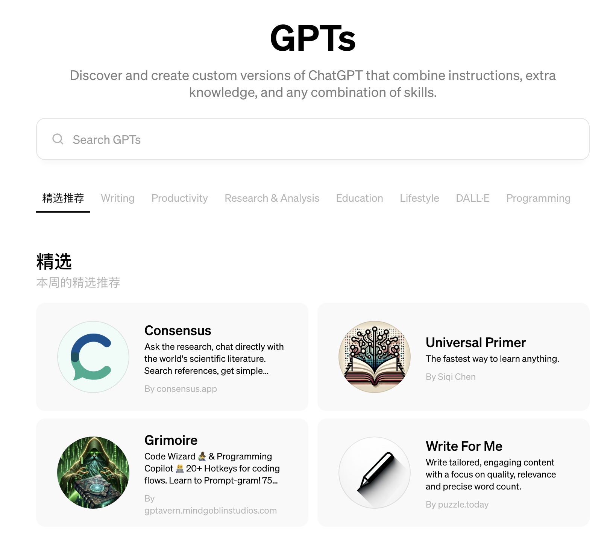

# 对OpenAI GPTs的一些非共识观点

去年11月，Sam Altman在发布GPTs功能的时候，提的概念是增加了Knowledge知识库和Actions的由用户定制的GPTs是AI Agent的雏形。但是当你看GPT Store首页排名前列的GPTs的时候，会发现好像完全不是这么回事。

首页的大多数GPTs甚至没有使用私有资料库和增加Actions，很多人会觉得也就是写一些Instructions prompt去完成特定场景的任务罢了，太薄太缺乏价值了。

这个观点，对，也不对。

目前GPT Store生态所表现出的特征基本是偏离Sam当初画的AI Agent的饼的，这也恰恰是很多产品不是被计划出来，而是「长」出来的，伟大不能被计划。

不只是去否定，而是带着好奇心去思考why的话，你会发现现在的GPT Store主要提供两种价值：
1）LLM使用场景的演示，比如现在排名最靠前的论文辅助、写作、logo设计、改写文案、生成接近真实的照片等等，相比生硬的聊天对话框，这些选择其实是让用户更容易地获得场景启发，发现：“啊，原来ChatGPT还能这么用”。
2）降低门槛，简化prompt要求，现在许多ChatGPT能力的激发或者优化是需要对LLM的特点和限制有一定理解的。比如现在大多数LLM都有所谓long context的能力，但是这个long只体现在输入上，输出时单次最长基本只有4096个token，所以写2000字以上长文时你需要分步骤完成，先进行文章结构规划，再分步一次次完成不同章节的写作。许多用户不理解这个概念，或者操作上有难度，而像「Writing」这个GPT就是帮用户更容易地完成这事的。

而以我自己的目前在Education排名全球11的[「更勤奋更聪明的GPT4」](https://chatgpt.com/g/g-vpdGZagEo-geng-qin-fen-geng-cong-ming-de-gpt4)来说，提示词也是极其简单，但他达成的一个效果就是让用户不需要写复杂的提示词就能获得相当长的优质回答，对许多用户而言，也不是他不会写prompt，而是你日常每个任务都要结构化思考的话是很累的一件事，有个小工具在那帮你轻松完成这件事不好吗？所以成了很多人打开ChatGPT时默认开启的界面。

几周后，GPT Store就会开放给免费用户使用了，你可以预期这会让GPTs的基础用户规模提升1000%以上，这其中会有什么样的机会，你能提供什么价值呢？可以试试去构建些东西

访问入口：https://chatgpt.com/g/g-vpdGZagEo-geng-qin-fen-geng-cong-ming-de-gpt4