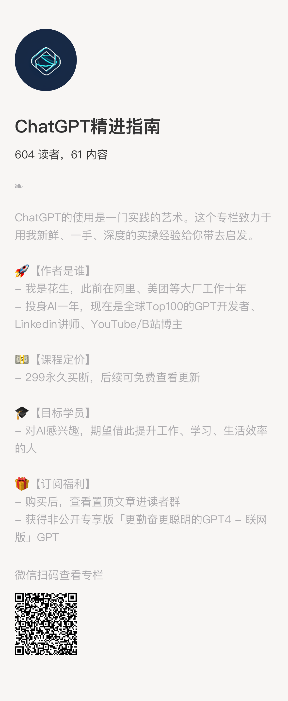

# 全球Top100 GPTs开发者的定制服务

## 一、关于我

### 我是谁

我是花生，一个AI从业者，2023年3月从互联网大厂离职后，专职在做AI工具开发、企业AI咨询顾问、AI自媒体、AI教育等工作。我的AI课程[「28个ChatGPT使用技巧」](https://www.bilibili.com/video/BV1a8411Q73z/)在YouTube、B站已获得超过60万人观看。你可以从我近期接受的媒体采访了解更多我的信息：

- **「腾讯研究院」的采访视频：[👉点这里](https://www.bilibili.com/video/BV1R1421U7f9/)**
- **「新周刊」的采访文章：[👉一键直达](https://mp.weixin.qq.com/s/So0COGAYUJ6_FPUXjrVLBQ)**
- **Youtube频道「AI进化论-花生」：**[👉点这里](https://www.youtube.com/channel/UCzbSuf_A_D8dARJ33HzoDew)

### 我的GPTs开发能力

我制作的GPTs无论从单个GPT的使用量还是开发者维度的统计来说，我都是全球top100的GPT开发者，[「更勤奋更聪明的GPT4」](https://chat.openai.com/g/g-vpdGZagEo-geng-qin-fen-geng-cong-ming-de-gpt4/)基本上是目前全球Top100使用量GPTs中唯一或唯二的中文GPT，并且登上了GPT Store的首页。你可以通过在[GPT Store](https://chat.openai.com/gpts)搜索我的网站“bookai.top”查看我制作的所有GPTs信息。

## 二、GPTs能做什么？

GPTs你可以理解为是一套定制化用于批量、标准化解决某类问题的AI工具。我在此前有给教育类、出海电商企业、网文MCN、抖音MCN等企业解决它们批量化制作课件、生成电商图片与文案、基于文本设计图片/视频、短视频&直播脚本制作等问题。

GPTs有五个基础能力让他能够去解决大多数的问题：

1. GPTs背后是GPT-4v模型，这依然是世界上最强大的模型，他对文本和图片的理解能力、推理能力都很强；
2. Instruction指令设置：类似于prompt提示词，通过系统化的指令词要求，你可以修正ChatGPT的工作方式和工作模式，学会人类的工作流，去实现模型能力的提升；
3. Knowledge知识库：通过知识库，你可以精确地让GPT学会和理解他原本预料中不存在不理解的问题；
4. 联网/绘图/代码解释器：这三项OpenAI自带的既有能力你可以直接用，实现模型必要时上网浏览信息、生成图片，以及写代码进行数据分析等工作；
5. Actions动作：这相当于是给了模型一只“手”，他可以通过这只手去使用别的网站和平台的服务，去做各种各样的事，比如绘制脑图，制作网站等等。

## 三、咨询流程

大致流程如下：

- 首先，你整理你目前遇到的问题或想解决的需求列表，包括你自己曾经做过的尝试和遇到的解决不了的问题；
- 接着，我会去你的需求进行分析，判断我自己是否有能力解决；
- 然后，如果我判断可以解决，我会预估需要花费的解决时间，并按我的咨询费标准进行定价；
- 如果你能接受我的定价，我将开始工作，并确定相应的结果验收标准。

## 四、如何找到我

微信：ALCHAIN （添加时注明来源和需求）

邮箱：alchaincyf@gmail.com

说实话，我这个服务定价不低，在开始考虑定制前，我比较建议你先查看我B站和Youtube所有的教学视频，以及通过我的[「ChatGPT精进指南」](https://xiaobot.net/p/AIclass)进行自主学习，确实解决不了了再找我。

或者，除了GPTs定制以外，你也可以通过跟我预约语音/视频咨询的方式去解决自己的问题，目前定价为：个人999/小时，企业1999/小时。
