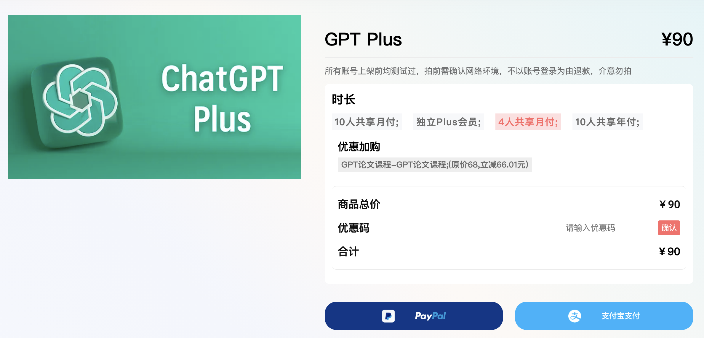

# 怎么注册使用ChatGPT Plus？

## 一、如何在 ChatGPT 官网注册和使用 ChatGPT？
首先，确保可以通过🪜访问他们的网站 https://openai.com/ 这部分工具选择太多了，也不适合细展开，实在不会且有需要的就先网上搜一搜，或者找找身边能用谷歌，能用ins的朋友帮帮忙；

在注册过程中，你需要使用非中国大陆的手机号接收验证码完成确认。以下是步骤和一些关键点：

1. 邮箱注册：尽量使用 Gmail 等国外公司的邮箱账号。使用 QQ 或 163 邮箱容易遇到提示问题。
2. 邮箱验证确认：若未收到验证邮件，请在垃圾邮件中查找。
3. 使用国外手机号获取验证码：前往可使用国外虚拟手机号付费接码的平台，如 https://sms-activate.org 或 https://5sim.net/zh 。这两个网站都有中文，可使用支付宝付款。在选择接码手机号时，最好选择印度的。更多疑问请参考 https://chatgpt-plus.github.io/chatgpt/

若实在无法解决，可以在近期出国或去港澳时购买临时电话卡，或请出国旅游的朋友帮忙提供手机号接收验证码。

## 二、注册成功了，有必要买Plus会员吗？
ChatGPT 是对 GPT 模型的一种官方特殊应用，可以接入不同的 GPT 模型。目前有三个版本的模型可选：常规的 GPT-3.5、以及最新的 GPT-4-turbo。GPT-4 相较于 GPT-3.5 有明显提升，但仅限 ChatGPT Plus 会员使用。

ChatGPT Plus会员在2023年3月时最大的优势仅仅是能使用性能更优的GPT-4，但是现在，会员与普通免费用户的差距越来越大了：
1. GPT4-turbo模型具有图片理解能力、能上传文件、能访问浏览器获取最新信息，甚至还能使用DALLE3模型生成图片；
2. GPT4-turbo模型具有128k的上下文记忆能力，与之对应的是GPT-3.5仅有8k，这个上下文长度直接觉得了你能给ChatGPT上传多长的文档，能对话多少轮，这个提升给ChatGPT解决复杂任务和长文本任务带来了质的飞跃。
3. 而且很重要的，2023年11月OpenAI还推出了允许用户定制的GPTs，这个能力允许用户生成自己的专属GPT应用，同时也能使用其他用户公开发布的GPTs，这让每个Plus用户可选择的小模型范围扩大了上万倍。

上面介绍的能力你都可以在我的[B站](https://space.bilibili.com/14097567)和[YouTube频道](https://www.youtube.com/channel/UCzbSuf_A_D8dARJ33HzoDew)找到对应的视频介绍。

购买 ChatGPT Plus 会员的难度较大，因为只能使用国外信用卡支付。目前，个人最容易解决这个问题的方式是通过虚拟信用卡账户平台（比如Depay）。但是涉及到的操作相对繁琐，需要身份认证，且相应工具通常还有开卡费、月度管理费、充值费等费用，不是绝对刚需的话不是很建议。疑问请参考https://chatgpt-plus.github.io/depay-card/

实际上，你可以在某宝搜索购买相关服务，或者像我一样，找个在国外上学的女朋友，然后借她的账号购买（🐶，开个玩笑）。实际上，以OpenAI操作的习惯来说，ChatGPT大概率也很快就能开放使用了，不用非得赶这趟。

## 三、以上操作都太麻烦了，有没有更轻松的方法？

你可以通过这个网站直接进行购买：https://nf.video/o9jj0s 
在2023年11月15日Sam Altman宣布停止ChatGPT Plus会员的注册后，这是少量还有库存还能买到ChatGPT账号，以及GPT Plus合租会员的平台。我特意为你申请了专属福利，在结算时输入“huasheng”，还会有93折的折扣。

