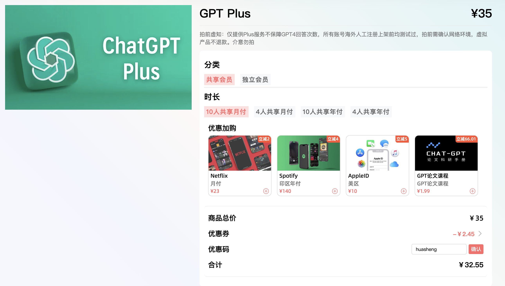
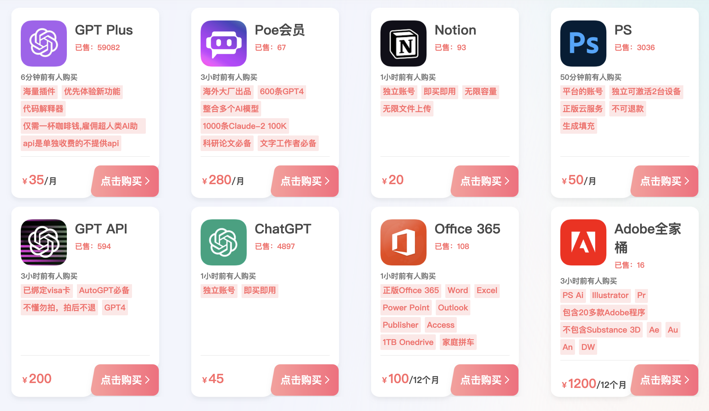
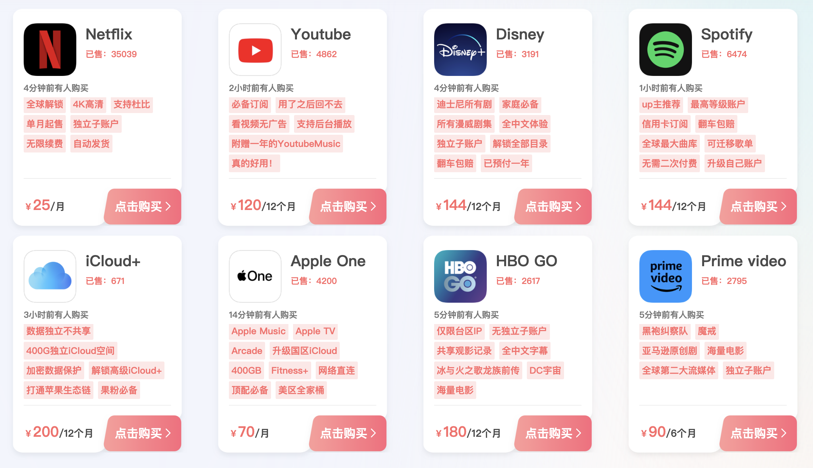

# 银河录像局优惠码

你可以通过这个链接访问银河录像局：https://nf.video/o9jj0s 使用优惠码“huasheng”购买所有虚拟商品都能获得93折折扣。

银河录像局目前提供便宜的ChatGPT Plus多人合租和独享账号这两种方式，如果你只是尝鲜的目的，可以先购买10人合租或4人合租的版本，但是因为目前ChatGPT本身对Plus会员的限制是3小时40次，所以越多人合租，你也就越容易受到限制。

我跟他们合作了一段时间，属于比较靠谱的平台，提供的账号都是真实有效的，如果遇到问题，也有客服会随时提供解决方案，能退款。

## 银河录像局靠谱吗？

[银河录像局](https://nf.video/o9jj0s)是一家新兴的流媒体和AI工具合租拼车平台，主要提供各类流媒体与生产力工具的合租服务，如Netflix、Disney+、HBO、AppleTV+、Midjourney、ChatGPT、PrimeVideo等。这个平台由杭州崇宇信息科技有限公司运营，实力不错，已经服务过10万+客服，并在各大社交媒体平台上有账号。他们的服务目标是为广大用户提供卓越的在线娱乐与生产力解决方案，致力于提供便捷、高效且稳定的服务。

- 平台特点：银河录像局是国内一家领先的智能奈飞合租平台，提供各类流媒体与AI生产力工具的合租服务。
- 服务内容：包括但不限于Netflix、Spotify、Disney+、HBO、AppleTV+、Midjourney、ChatGPT、PrimeVideo、和Paramount+等。
- 用户保障：提供售后保障，翻车必赔。
- 客服支持：10万+用户，客服团队全年无休，提供售前售后服务。
- 网站访问量：月访问量约50万。

### AI工具合租服务
- ChatGPT Plus：35/月，不同合租版本价格有差异
- ChatGPT账号：45/个
- Poe：280/月
- ChatGPT API：200/个
- Midjourney：59/月
- Office 365：100/年

### 流媒体合租服务
- Netflix：提供4K高清、支持杜比、独立子账户，自动发货，价格为￥25/月。
- Spotify：提供最高等级账户，信用卡订阅，全球最大曲库，可迁移歌单，无需二次付费，升级自己账户，价格为￥144/12个月。
- Disney+：包含迪士尼、皮克斯、漫威和星球大战等品牌的影视内容，独立子账户，预付一年，解锁全部目录，价格为￥116.88/年。
- Youtube：120/年
- Disney：144/年
- Apple One：70/月
- HBO GO：180/年
- Prime video：90/6个月

此外，还有多邻国Plus会员等学习类账号，可以去看看：https://nf.video/o9jj0s （优惠码“huasheng”）

