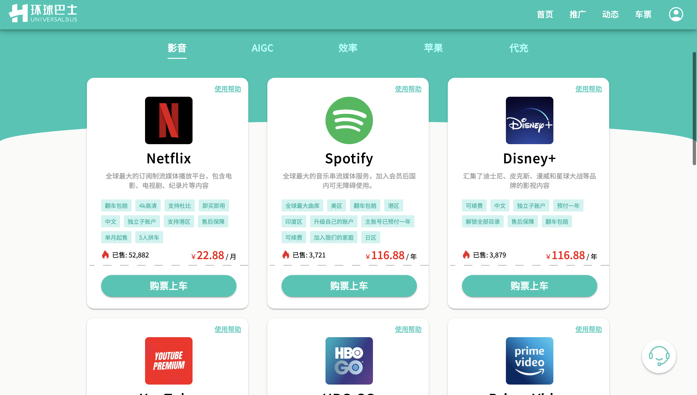
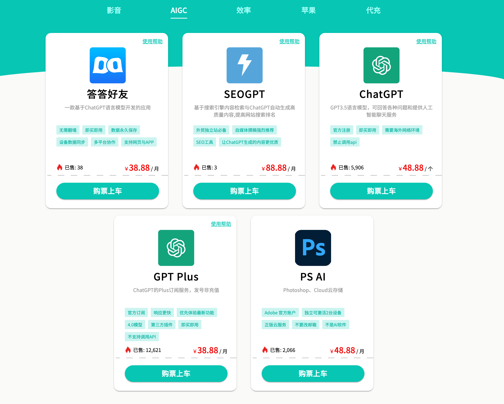

# 环球巴士优惠码

你可以通过这个链接访问环球巴士：https://universalbus.cn/?s=5HCba2gPfO 使用优惠码“huasheng”购买所有虚拟商品都能获得9折折扣。

环球巴士目前提供便宜的ChatGPT Plus多人合租和独享账号这两种方式，如果你只是尝鲜的目的，可以先购买10人合租或4人合租的版本，但是因为目前ChatGPT本身对Plus会员的限制是3小时40次，所以越多人合租，你也就越容易受到限制。

我跟他们合作了一段时间，属于比较靠谱的平台，提供的账号都是真实有效的，如果遇到问题，也有客服会随时提供解决方案，能退款。

## 环球巴士靠谱吗？

[环球巴士](https://universalbus.cn/?s=5HCba2gPfO)

- 成立时间：2019年
- 主营业务：会员合租、代充值以及多项便捷服务
- 产品范围：Netflix、Spotify、Disney+、YouTube、Apple One 等流媒体服务，以及ChatGPT、Midjourney、Notion 等AI工具
- 用户保障：安全担保，翻车必赔
- 特色服务：自主开发的应用工具，如答答好友、SEOGPT等
- 客户服务：全天在线客服，实时解答产品问题
- 用户数量：超过10万+

### AI工具合租服务
- ChatGPT Plus：38.8/月，不同合租版本价格有差异
- ChatGPT账号：48.8/个
- PS AI：48.88/月

### 流媒体合租服务
- Netflix：￥22.88/月
- Spotify：￥116.88/年
- Disney+：￥116.88/年
- Youtube：￥138.88/年
- HBO GO：￥178.88/年
- Prime video：￥59.88/6个月
- Hulu：￥88.88/3个月
- Paramount+：￥59.88/3个月
- Peacock：￥59.88/3个月
- Tidal：￥45.88/3个月

环球巴士原名是奈飞站，是做影音流媒体会员起家的，所以相较来说，流媒体方面的资源比较丰富，价格也还比较有优势。除了上面提供的账号之外，还有108.88/年的多邻国Duolingo会员、68.88/年的Notion会员、88.88/年的Office 365会员等，可以去看看：https://universalbus.cn/?s=5HCba2gPfO  （优惠码“huasheng”）

